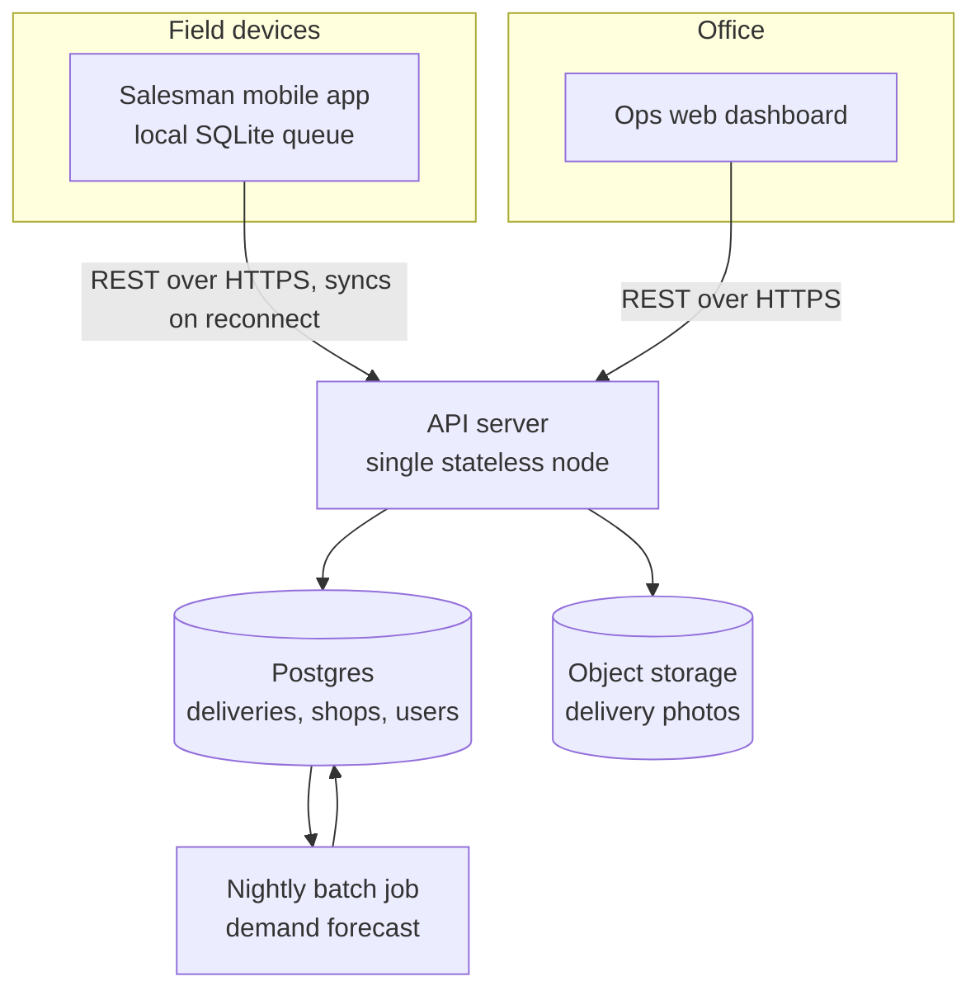
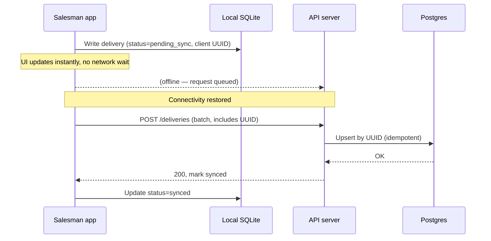
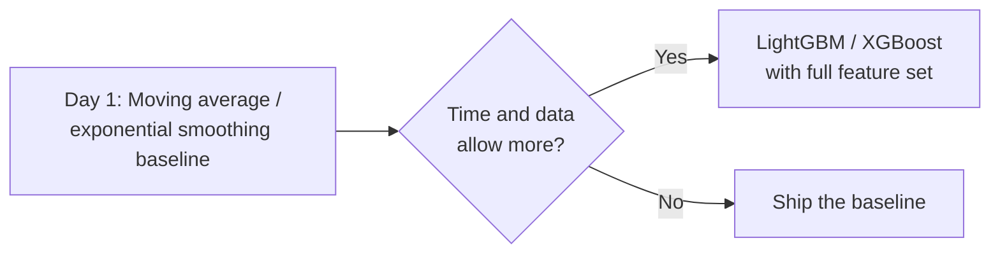
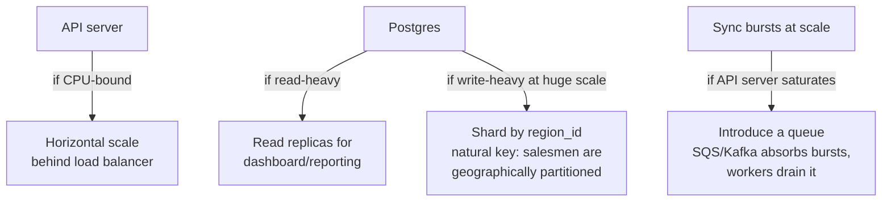

## Problem Statement

`Company ABC` wants an app for its salesmen, built in **two days**, with an unspecified AI feature left to the candidate to define.

## Clarifying the problem

Before designing anything, narrow the scope. Ambiguous prompts are intentional — the interviewer wants to see how you handle them.

Questions to ask, and reasonable answers to assume if the interviewer pushes them back to you:

| Question | Assumption |
|---|---|
| Who are the users? | Only `Company ABC's` salesmen (delivery agents) + an internal ops/admin team. No customer-facing app. |
| What does "delivery" mean? | One-directional: pick up stock at depot, drop at shop/retailer. Proof of delivery required (photo + geotag). |
| Scale? | ~500 salesmen, ~20 deliveries/salesman/day → **10,000 deliveries/day**. |
| Network conditions? | Salesmen work in the field — assume patchy connectivity. Offline support is a hard requirement. |
| What AI feature? | Unspecified — the candidate should propose one and justify it. |

### Why these assumptions matter

A two-day deadline and a small user base (500 people) are the two biggest constraints in this problem. They should shape *every* downstream decision: favor monoliths over microservices, batch over real-time, and existing managed services over anything custom.

## Choosing the AI feature

Since the prompt deliberately leaves the AI feature open, the choice itself is being evaluated. Candidates should pick something that:

- Uses data the system will already be collecting (delivery history)
- Has clear, explainable business value
- Doesn't require infrastructure you don't have time to build in two days (e.g., no real-time GPS/traffic data pipeline)

### Alternatives considered

| Option | Verdict | Reason |
|---|---|---|
| **Demand forecasting** (chosen) | ✅ | Uses existing order history, batch-friendly, clear ROI (fewer stockouts/overstock) |
| Route optimization | ❌ (for v1) | Needs live GPS + traffic/map APIs — too much new infra for 2 days |
| Delivery time prediction (ETA) | ❌ (for v1) | Needs live location streaming; more valuable for customer-facing apps than internal ones |
| Fraud/anomaly detection on deliveries | ❌ (for v1) | Useful later, but no baseline data yet to detect anomalies against |
| Chatbot/AI assistant for salesmen | ❌ | Novelty feature, doesn't map to a real pain point in the prompt |

**Demand forecasting** wins because it's low-infrastructure, high-value, and directly usable by both salesmen (what to carry) and ops (what to stock).

## Requirements

### Functional

1. Salesman: view assigned deliveries, mark delivered (photo + geotag), see suggested stock per route
2. Ops: assign deliveries to salesmen, view dashboard, view demand forecasts
3. System: forecast per-shop/per-SKU demand for the next N days
4. System: queue and sync data written while offline

### Non-functional

1. **Offline-first** — the mobile app must remain usable with no signal; writes queue locally and sync later
2. **Availability over consistency** (AP over CP in CAP terms) for delivery status — eventual sync is acceptable, there's no financial/inventory transaction that needs strict consistency
3. Low latency for interactive app actions (<500ms); forecasting can be asynchronous/batch
4. Scale is small — 500 users, ~10K writes/day — the system should be **right-sized**, not over-engineered

> **Interview signal:** explicitly saying "I will not over-engineer this for scale I don't have" is one of the strongest signals of seniority you can give in a system design interview.

## Capacity estimate

Quick back-of-envelope numbers, mainly to justify *not* over-building:

- **QPS:** 10,000 deliveries/day ÷ 86,400s ≈ 0.12 writes/sec average. Even at peak (9 field-hours) ≈ 0.3 writes/sec. Trivially handled by a single server.
- **DB rows:** 10K/day × 365 ≈ 3.65M rows/year. No sharding needed on Postgres at this scale.
- **Photo storage:** 1 photo/delivery × ~500KB compressed × 10K/day = **5GB/day**, ~1.8TB/year. Cheap on object storage; this is the only component with real storage growth.
- **Forecast batch job:** ~5,000 shops × 50 SKUs ≈ 250,000 predictions/night. A single nightly batch job handles this in minutes.

**Conclusion to state out loud:** the constraint in this problem is *time to build* and *field reliability*, not throughput. Every architecture decision below optimizes for those two things.

## High-level architecture

### Component rationale

| Component | Choice | Alternative considered | Why the chosen option wins here |
|---|---|---|---|
| Backend | Single monolithic API server | Microservices | Team size and 2-day deadline make service boundaries, deployment pipelines, and inter-service networking pure overhead |
| Database | Postgres | DynamoDB / Mongo | Relational data (deliveries → shops → salesmen), small scale, ACID for the assignment/status workflow, team likely already knows SQL |
| Photo storage | Object storage (S3-compatible), uploaded via presigned URL | Store in DB as BLOB | Keeps large binary traffic off the API server; presigned URLs let the client upload directly |
| Offline queue | Local SQLite on device | In-memory queue only | Survives app kill/restart and phone reboot — a memory-only queue loses data |
| Forecasting | Decoupled nightly batch job | Real-time inference service | No user-facing feature needs sub-second predictions; decoupling means a forecasting failure can't take down the delivery app |

## Deep dive: Offline sync

This is the trickiest sub-problem in the design, and the one most interviewers will push on.

### What can go wrong, and the fix

| Failure mode | Cause | Mitigation |
|---|---|---|
| Duplicate delivery records | Retry after an ambiguous failure (request succeeded, ack lost) | Client-generated UUID as an **idempotency key** — server upserts, never inserts twice |
| Delivery synced but photo missing | Large photo upload fails independently of the small delivery record | Decouple: sync the delivery record first with `photo_status=pending`; photo uploads separately and updates that field on success |
| Clock skew | Device time may be wrong when "delivered_at" is recorded | Store both device timestamp and server `received_at`; use server time as source of truth for ordering/reporting |
| Sync storm | Many salesmen reconnect around 6pm and push queued data simultaneously | Client-side batching + jittered retry/backoff; server load stays trivial (<1 req/sec avg) regardless |
| Concurrent edits | Two actors editing the same delivery | Not a real risk here — each delivery has exactly **one owner** (one salesman), so there's no multi-writer conflict to resolve |

**Key framing for the interview:** because each record has a single owner, this is *not* a general distributed-conflict problem (no CRDTs, no vector clocks needed) — it reduces to reliable at-least-once delivery with idempotency. Naming why you *don't* need heavyweight tools is as valuable as naming the tools you do use.

## Deep dive: Demand forecasting

### 1. Framing

Predict quantity per `(shop, SKU)` pair needed at the next visit — a **regression** problem, not classification.

### 2. Features

- **Historical:** past order quantities per shop/SKU, order cadence
- **Shop attributes:** size/tier, location, category (grocery vs. pharmacy)
- **Time features:** day of week, month, holiday/festival flags (Eid demand spikes matter a lot in this market)
- **SKU attributes:** category, price, seasonality

### 3. Cold start

New shops have no history. Fall back to a **tier average** (similar size/location/category shops); blend in shop-specific signal once 3–4 order cycles of real data exist.

### 4. Model choice

| Option | Verdict | Reason |
|---|---|---|
| Moving average / exponential smoothing | ✅ Day-1 baseline | Zero training infra, ships immediately, good enough for a first cut |
| Gradient boosted trees (LightGBM/XGBoost) | ✅ Stretch goal | Best fit for small-to-medium tabular data, trains in minutes, outperforms deep nets here |
| Deep learning / transformer-based forecaster | ❌ | Not enough data (thousands of shop-SKU pairs), can't be justified in a 2-day build, higher latency for no accuracy gain |
| Real-time streaming forecast | ❌ | No use case needs sub-daily freshness; adds Kafka/streaming infra with no payoff |

### 5. Serving and monitoring

- **Batch only** — nightly job writes to a `forecasts(shop_id, sku_id, predicted_qty, date)` table; app and dashboard just read it. No inference endpoint, no latency concerns.
- **Monitoring:** track weekly MAPE (mean absolute percentage error) per shop-SKU; retrain weekly since data volume is small and retraining is cheap.

## Scaling 

At 500 salesmen / 10K deliveries per day, nothing here needs to scale. But interviewers will ask "what if this grows 100x?" — here's the honest answer, with the explicit note that **none of this should be built preemptively**.

The first real architectural change, if it ever comes, is introducing a message queue between the mobile sync endpoint and the API — everything else is a config/infra change, not a redesign.

## Trade-offs summary

| Decision | Chose | Gave up | Why |
|---|---|---|---|
| CAP posture | Availability (offline-first) | Strong consistency | Field usability matters more than instant consistency; no financial transaction at stake |
| Service architecture | Monolith | Microservices | 2-day deadline, tiny team — service overhead isn't affordable |
| Forecast serving | Batch | Real-time freshness | Planning use case tolerates staleness up to 24h |
| Forecast model | Gradient boosted trees | Marginal deep-learning accuracy | Small tabular dataset; DL isn't trainable or justifiable in 2 days |
| Duplicate-write prevention | Client-generated UUID + server idempotency | Simpler auto-increment IDs | Only viable way to make offline retries safe without server-side dedup logic |
| Photo path | Direct-to-object-storage via presigned URL | Route through API server | Keeps large binary traffic off the app server |

## Closing statement

> "Given the two-day deadline and the actual scale (500 users, ~10K writes/day), I optimized for build speed, offline reliability, and a demand-forecasting feature that reuses data the system already collects — rather than for scale I don't have. I called out explicitly where I'd add complexity (queues, sharding, real-time inference) if requirements or scale changed, but none of that is justified on day one."
