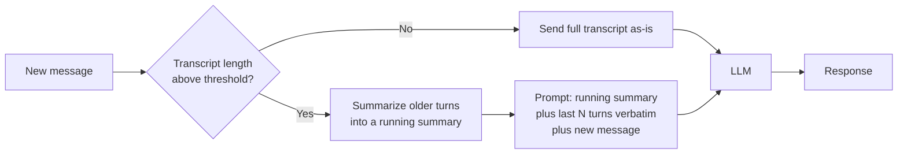
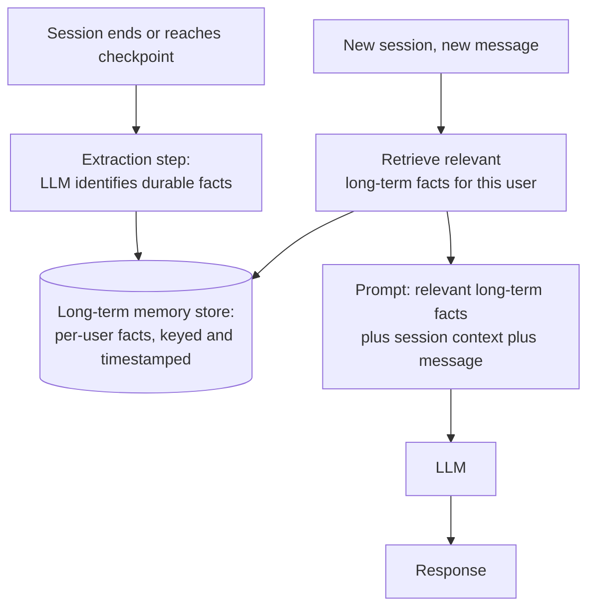
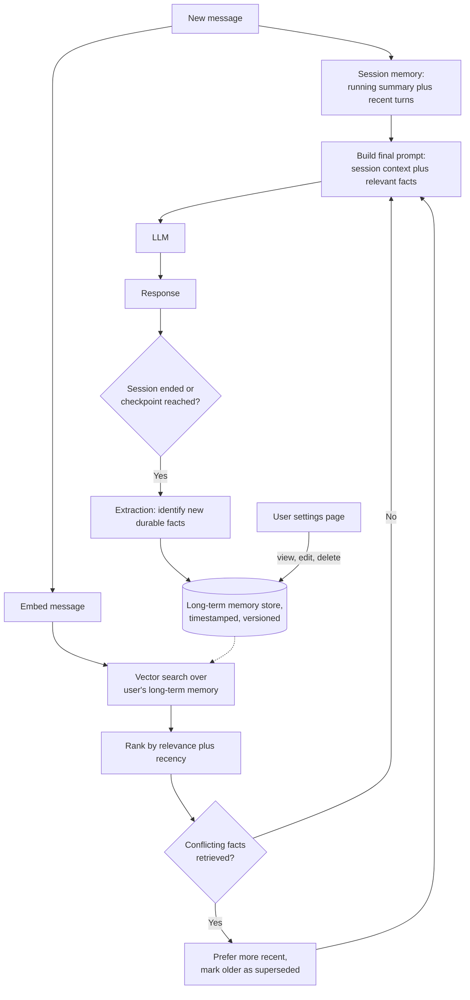

## Problem Statement

Design a chat product powered by an LLM that remembers what the user has told it — both within a conversation and across sessions over time.

We will start with the simplest working version, find exactly where it breaks, and add only the component that fixes that specific break. Every stage names the alternative that was considered and rejected.

## Clarifying the problem

- **Product:** a general-purpose conversational assistant (think: a ChatGPT/Claude-style consumer or enterprise chat product), not a narrow single-task bot
- **Memory scope:** two distinct kinds, and they must be designed separately —
  - **Short-term (within-session) memory:** what was said earlier in the *current* conversation
  - **Long-term (cross-session) memory:** facts the user told the system days or weeks ago, in a different conversation entirely
- **Scale (baseline):** start small — 10,000 users, ~5 messages/session, a few sessions/week — then scale up explicitly later
- **Context beyond chat history:** user preferences, prior stated facts, possibly documents/tools — introduced as the design matures, not assumed from day one

## Capacity estimate (baseline)

Quick back-of-envelope numbers at the baseline scale (10,000 users, ~5 messages/session, ~3 sessions/user/week):

- **Messages:** 10,000 × 3 × 5 = 150,000/week ≈ 21,400/day → ÷86,400s ≈ **0.25 req/sec average** — trivial, well within single-server territory
- **Storage per message:** ~500 bytes (text + metadata) → 21,400/day × 500B ≈ 10.7MB/day, ~4GB/year — negligible
- **Long-term memory facts:** assume ~5 durable facts extracted per user at this stage → 10,000 × 5 = **50,000 records** — trivially small for any index, not yet a retrieval problem

**Why this matters for the design that follows:** these numbers are exactly what justify V0 through V3 staying simple — "fetch all the user's stored facts, no ranking needed" (V3) isn't a guess, it's a direct consequence of 50,000 total records being nothing to search through. The same technique — convert to req/sec, compare against known single-server thresholds (~1K-5K req/sec) — is what will later justify *why* V4/V5 need to change as the numbers grow.

## V0 — Stateless, single-turn

**Design:** every message is independent. No history, no memory. The user sends a message, the LLM responds, nothing is stored.

```
User message → LLM → Response (forgotten immediately after)
```

**Why start here:** this is the "no memory at all" baseline — naming it first shows *why* memory is needed, rather than assuming it.

**Why it fails almost immediately:** the moment a user says "actually, make that shorter" or asks a follow-up referencing anything said one message earlier, the system has no idea what "that" refers to. This isn't a scale problem or an edge case — it's the core expectation of a *chat* product, broken on message two.

**The fix this points to:** the system needs to remember what was said earlier in the same conversation — short-term, within-session memory.

## V1 — Session memory (short-term)

**Design:** store the full conversation transcript and re-send it as context on every subsequent message in the same session.


| Component | Purpose | Alternative considered | Why rejected at this stage |
|---|---|---|---|
| Session store | Holds the transcript for one conversation | No server storage — client re-sends full history each time | Not wrong, actually — many real chat APIs are stateless this way, with the client owning history. The trade-off is client-side reliability. For a product with a persistent UI, server-side session storage is simpler and enables later stages (summarization, cross-device continuity) |
| Full-transcript resend | Every message includes the entire prior conversation | Only send the last N messages | Only-last-N silently loses anything before N turns — arbitrary and fragile. Full transcript is correct until it hits a real limit, at which point the fix should be principled (next section), not an arbitrary cutoff picked upfront |

**Why this fixes V0:** the model now sees everything said earlier in the conversation, so follow-ups and references ("make that shorter") resolve correctly.

**What V1 breaks on:**
1. **Context window limit** — a long conversation eventually exceeds the model's context window. Not a scale problem — a hard ceiling that arrives faster than expected.
2. **Cost and latency** — resending the full transcript on every turn means cost grows linearly with conversation length, and every message re-processes the entire history.
3. **Cross-session memory** — close the app and reopen tomorrow, the assistant remembers nothing. No product commonly described as having "memory" stops at session-only.

## V2 — Fixing the context window: summarization

**Problem:** the transcript will eventually exceed the context window, and cost/latency grow with every turn even before that.

**Design:** a **rolling summary** combined with a **recent-turn window** — instead of resending the full transcript, resend a compressed summary of everything older, plus the verbatim text of the last few turns.



| Alternative | Rejected because |
|---|---|
| Hard truncate — drop the oldest messages once over budget | Loses information silently and unpredictably — a fact from 15 messages ago vanishes with no trace, and no signal to the user that it happened |
| Summarize on every turn, regardless of length | Wastes an LLM call on short conversations that never approach the limit — summarization should trigger only when needed |
| Keep full transcript, use a bigger-context model | Doesn't fix cost (still reprocessing everything every turn) and only pushes the ceiling further out — same failure returns on longer conversations |

**Why summarize instead of dropping old turns:** a summary compresses without discarding — key facts and decisions from earlier survive in condensed form, even if exact wording doesn't. Same principle as V1's fix to V0: don't lose information, compress it intelligently.

**Mechanically:** summarization is a cheap, smaller LLM call — "summarize this conversation so far, preserving key facts, decisions, and unresolved questions" — triggered only once the transcript crosses a length threshold. If the conversation runs long enough that even the summary grows large, it gets re-summarized (summary-of-summary).

**What V2 still doesn't solve:** cross-session memory (nothing survives closing the conversation), and it raises a new question — what happens if a summary drops a fact that matters later, or two summarized facts start to contradict each other as the conversation evolves?

## V3 — Cross-session (long-term) memory

**Problem:** users expect the assistant to remember things across separate conversations — "I mentioned last week I'm vegetarian" should carry into a brand-new chat session.

**Design:** a **separate long-term memory store**, decoupled from any single session's transcript, populated by an extraction step that runs periodically, not on every message.



| Alternative | Rejected because |
|---|---|
| Store and resend the user's entire chat history across all sessions, forever | Context window makes this impossible past a small number of sessions, and most of any conversation isn't a durable fact worth remembering — "thanks!" doesn't need to persist |
| Store every message verbatim in long-term memory, retrieve via search when needed | Closer to viable (this is essentially V4's approach), but skipping extraction means storing huge amounts of low-signal text and searching over noise — extraction first separates signal from noise before storage even happens |

**What "durable fact" extraction looks like:** a cheap-model LLM call, run asynchronously and not blocking the user's response, that reads a session's transcript and pulls out things like stated preferences ("vegetarian," "prefers concise answers"), stable facts ("works as a nurse," "lives in Austin"), explicitly excluding transient details (today's weather question, a one-off math problem). Each extracted fact is stored with a timestamp and source session ID.

**Retrieval side:** when a new session starts, pull the user's stored facts relevant to the current message — a small, fast lookup at this scale (a user has dozens to a few hundred facts, not millions), not yet a heavy search problem.

**What V3 still doesn't solve:**
1. Two extracted facts contradicting each other over time (vegetarian last month, "I eat chicken now" this month)
2. At what point does even a small per-user store need real ranked retrieval instead of "fetch everything"
3. User control — correcting or deleting something the system remembers

## V4 — Retrieval-based memory, conflict resolution, user control

### Fix 1 — Memory grows past "fetch everything"

**Problem:** V3's "fetch all stored facts" works for a few dozen entries. It breaks for a long-time power user with hundreds or thousands of extracted facts, most irrelevant to the current message.

**Design:** treat long-term memory the same way a RAG system treats documents — embed each stored fact, retrieve only the **top-k most relevant** to the current message via vector similarity, weighted by recency (a fact from yesterday is generally more reliable than one from eight months ago). This is a direct application of RAG-style retrieval architecture, just with a small, personal corpus instead of a large shared one.

| Alternative | Rejected because |
|---|---|
| Keep fetching all stored facts regardless of count | Eventually exceeds context budget the same way full-transcript resending did in V1, and dilutes the prompt with irrelevant facts |
| Only keep the most recent N facts, discard older ones | Loses genuinely durable facts just because they're old — recency should be a *ranking* signal, not a hard cutoff |

### Fix 2 — Conflicting memories

**Problem:** memory extracted over time will contradict itself — the same class of problem as contradicting documents in a large-scale RAG design.

**Design:** don't silently overwrite old facts with new ones, and don't silently keep both unacknowledged. On retrieval, prefer the more recent fact when two conflict, and mark the older one as **superseded**, not deleted — timestamp-based versioning. If the contradiction is directly relevant to the current response, it's reasonable for the assistant to surface it naturally ("you'd mentioned being vegetarian before — has that changed?") rather than silently picking a side.

| Alternative | Rejected because |
|---|---|
| Always overwrite the old fact with the new one | Loses history — if the user later says "go back to how I used to eat," there's nothing left to go back to |
| Keep both and let the LLM sort it out at generation time | Pushes a solvable problem into the least reliable place to solve it — the model guessing between contradictory context is exactly the hallucination risk memory management exists to prevent |

### Fix 3 — User control over memory

**Problem:** users need to see, correct, and delete what the system remembers about them — a product expectation, and in many jurisdictions closer to a legal one.

**Design:** the long-term memory store needs a direct read/write surface — a settings page listing stored facts in plain language, with edit/delete controls writing directly to the same store the retrieval step reads from. A user-initiated deletion is treated as an authoritative, immediate override, not something that waits for the next extraction cycle.

**Why this can't be an afterthought:** extraction is an LLM call, and LLM calls are imperfect — a memory system with no user visibility or correction path compounds small errors over time in a way session-only memory never could, since session memory naturally resets on its own.

## V4 Architecture



## V5 — Scaling to a mass-market product

### 1. Mid-scale checkpoint — 1 million users

Before jumping to mass-market numbers, check the midpoint — this is where an interviewer will often probe first, since it reveals whether V4 was actually sufficient or just got lucky at toy scale.

- 1,000,000 users × 3 sessions/week × 5 messages ≈ 15M messages/week ≈ 2.1M/day → ÷86,400s ≈ **25 req/sec average**, peak maybe 3-4x ≈ **75-100 req/sec**
- Long-term memory: ~20 facts/user by this point (more accumulated history than the baseline) → 1,000,000 × 20 = **20 million records**

**Checkpoint verdict:** still comfortably within V4's design. 75-100 req/sec is well under a single well-provisioned server's ceiling (though 2-3 API nodes behind a load balancer is a reasonable, cheap precaution here, not a redesign). 20 million memory records is still small enough for a single vector index instance with proper indexing (HNSW) — the "fetch and rank top-k" approach from V4 works fine; it's the **unpartitioned single index** that would start to show query latency creep, which is the first hint of what changes next.

**What this checkpoint proves:** V4's retrieval-based memory design (added specifically to fix "fetch everything" breaking down) was the right fix at the right time — it doesn't need to be revisited again until the numbers below force a structural change, not just a bigger instance.

### 2. Capacity estimate — mass-market scale

Assume growth to **50 million users**, ~3 messages/session, ~2 sessions/week/active user, with roughly 30% of users active on a given day.

- **Daily active users:** ~15M
- **Messages/day:** 15M × 3 ≈ 45M/day → ÷86,400s ≈ **520 req/sec average**, peak (concentrated hours) maybe 3-4x ≈ **1,500-2,000 req/sec**
- **Long-term memory store:** if an average user accumulates ~100 durable facts over time, 50M users × 100 ≈ **5 billion memory records** — this is the component that changes shape most at this scale

### 3. Comparing against thresholds

| Component | Still fine at this scale? | Reasoning |
|---|---|---|
| API/orchestration layer | Yes, with horizontal scaling | 1,500-2,000 req/sec exceeds one server's comfortable margin once orchestration overhead is included — multiple stateless nodes behind a load balancer, same pattern as every earlier design in this series |
| Session store | Yes | Session data is per-conversation, short-lived, and naturally partitions by session ID — a sharded Redis/key-value store scales horizontally without architectural change |
| Long-term memory vector search | No — needs redesign | 5 billion vectors is far beyond a single-node or even a small-cluster vector index. Needs a **distributed, sharded vector store partitioned by user ID** — critically, each user's memory search only ever needs to query *that user's own shard*, never the global 5B-vector space. This is a much easier scaling problem than a shared corpus (like the 10M-document RAG design), because queries are naturally, permanently partitioned per user |
| Extraction pipeline | Needs to move from ad hoc calls to a queued pipeline | At 15M daily active users, session-end extraction calls need to be a durable, asynchronous **queue-backed worker pool**, not a synchronous call in the request path — extraction failures shouldn't ever affect the user's live conversation |
| LLM inference cost | Architecturally fine, but now the dominant cost | 1,500-2,000 req/sec of both the main chat response and background extraction calls is the point where the API-vs-self-hosted-inference trade-off (from earlier RAG designs) becomes a real, load-bearing decision rather than a footnote |

**Key structural insight specific to this problem:** unlike a shared-document RAG system, per-user long-term memory is **embarrassingly partitionable** — user A's memory is never relevant to user B's query. This means the hardest scaling problem in a shared-corpus RAG system (cross-shard relevance ranking) doesn't really exist here; the long-term memory store scales by adding shards keyed on user ID, and each query only ever touches one shard.

**Explicitly rejected at this scale:** a single unpartitioned vector index across all users' memories, relying on a metadata filter (`WHERE user_id = X`) to select relevant results at query time — same anti-pattern rejected in the access-control discussion of the RAG document design. Filtering after search wastes the search itself on 4.999 billion vectors that could never have mattered for this query; partition first, search second.

## Guardrails and evaluation

### Guardrails

- **Input guardrails:** detect prompt injection attempts aimed at extracting another user's memory, or attempts to make the extraction pipeline store false/manipulated "facts" about the user
- **Extraction guardrails:** the extraction step should have a confidence threshold too — don't store a "fact" the extraction model itself is unsure about; a wrong memory is worse than no memory, since it will silently bias every future conversation
- **Output guardrails:** the same faithfulness principle from RAG design applies here — if the assistant references a long-term memory fact, that reference should be checked against what's actually stored, not paraphrased into something subtly different

### Evaluation

- **Memory precision** — when the assistant references something it "remembers," is that reference actually accurate to what the user said?
- **Memory recall** — does the system successfully retrieve and use a relevant stored fact when it should, or does it miss the memory and treat the user like a stranger?
- **Conflict handling accuracy** — when facts genuinely conflict, does the system correctly identify and surface the conflict rather than picking silently or getting confused?
- **User correction rate** — how often do users have to manually fix or delete a stored memory? A rising rate signals extraction quality is degrading, the same way a rising "no relevant docs" rate signals retrieval degradation in a RAG system.

## Closing summary

The system evolved through five stages, each fixing a specific, named failure of the version before it:

- **V0 → V1:** stateless replies → session memory, because a chat product without within-conversation memory isn't really a chat product
- **V1 → V2:** full-transcript resend → summarization, because context windows and per-turn cost both have hard limits that arrive faster than expected
- **V2 → V3:** session-only memory → a separate long-term store, because users expect continuity across conversations, not just within one
- **V3 → V4:** fetch-everything long-term memory → retrieval, conflict resolution, and user control, because memory that grows unbounded, contradicts itself silently, or can't be corrected by the user becomes a liability rather than a feature
- **V4 → V5:** moderate scale → partitioned distributed storage and a queued extraction pipeline, because the numbers at mass-market scale cross concrete thresholds — while the per-user partitioning structure of memory turns out to make this an easier scaling problem than a shared-corpus RAG system, not a harder one

The same principle closes this design as closed the others in this series: match the architecture to the actual, current constraints, and name the next necessary upgrade explicitly rather than building it before the evidence calls for it.