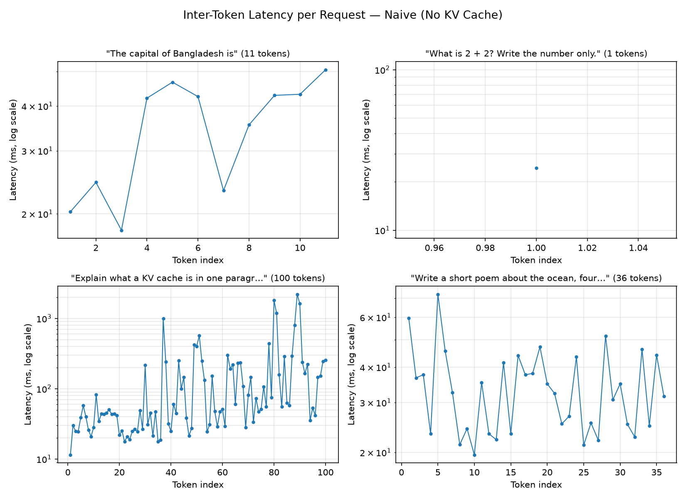

## Motivation

Serving engines like vLLM, SGLang, and TensorRT-LLM are full of optimizations that look arbitrary from the outside — paged KV caches, continuous batching, speculative decoding, kernel fusion, CUDA graphs. Reading their source code without having felt the problems these solve firsthand means memorizing a list of tricks instead of understanding a system.

So I'm building **MicroServe**: a minimal LLM inference engine, from scratch, one serving topic at a time. For each topic: survey the real techniques, implement one by hand, measure it, and only move to the next topic once the numbers make the next optimization's necessity obvious. This isn't an attempt to rebuild vLLM — it's an attempt to earn the right to read vLLM's source and immediately recognize why every ugly line is there.

> **This post is Phase 1:** the naive inference path. No cache, no batching, no cleverness. Just a baseline, and the receipts showing exactly why it has to change.

## Configuration

- **Hardware**: MacBook Air M1 (2020), 8GB unified memory
- **Framework**: PyTorch, device-agnostic (`cuda` / `mps` / `cpu`, auto-detected — the same code has to run on a CUDA box later without modification)
- **Model**: `Qwen/Qwen3-1.7B`, fp16 (~3.2 GB footprint)
- **Decoding**: greedy (deterministic — makes runs comparable across phases without sampling noise as a confound), chat-template formatted, thinking mode off, `max_new_tokens=128`

## How a Transformer Predicts the Next Token

A language model generates text one token at a time. To predict the next token, every layer of the model needs to look back at every token that came before it — that's what "attention" means. Concretely, each token gets turned into three vectors: a **Query** (what this token is looking for), a **Key** (what this token represents, so other tokens can decide whether to attend to it), and a **Value** (the actual information this token carries). The model compares the current position's Query against every earlier position's Key to decide how much weight to give each position's Value. Stack that across every layer, and the final layer's output gets turned into a probability over the entire vocabulary — the model's guess at what comes next.

The detail that matters for everything in this project: **a token's Key and Value never change once computed.** Token 5's Key and Value depend only on token 5 and what came before it — not on what gets generated afterward. So computing them twice is pure waste. That's the whole idea behind a KV cache: compute each token's Key/Value once, keep them around, reuse them for every future step.

This phase does the opposite on purpose — it throws them away every time — so the cost of *not* caching is something you can actually see in the numbers, not just take on faith.

## Generating Text Without a Cache

The simplest possible generation loop looks like this:

1. Run the prompt through the model.
2. Look at the model's prediction for the very last position, and pick the most likely next token.
3. Append that token to the sequence.
4. **Run the model again — from scratch — over the whole sequence: prompt + everything generated so far.**
5. Repeat until the model produces an end-of-text token or a length limit is hit.

Step 4 is the naive part. Here's the actual loop (`src/microserve/engine/naive.py`):

```python
for _ in range(config.max_new_tokens):
    step_start = time.perf_counter()

    outputs = model(input_ids=generated_ids, use_cache=False)   # recompute everything, every step
    next_token_logits = outputs.logits[:, -1, :]
    next_token = torch.argmax(next_token_logits, dim=-1, keepdim=True)
    generated_ids = torch.cat([generated_ids, next_token], dim=1)

    step_end = time.perf_counter()
    per_token_latencies_ms.append((step_end - step_start) * 1000)

    if next_token.item() == tokenizer.eos_token_id:
        break
```

`use_cache=False` is the one line doing all the damage. It forces the model to recompute attention over `generated_ids` — which grows by one token every iteration — from zero, every single time, discarding all the Key/Value pairs it just computed.

Here's why that's expensive in a way that compounds: the cost of one forward pass grows roughly with how many tokens it has to process. If generating token `k` means processing `prompt_len + k` tokens from scratch, then the total work to generate `n` tokens is roughly `1 + 2 + 3 + ... + n`, which grows proportionally to `n²`. A cached loop, by contrast, only ever processes *one new token* per step — its total work grows proportionally to `n`, not `n²`. That gap between "grows like n" and "grows like n²" is the entire reason Phase 2 exists.

To make the Key/Value structure concrete rather than abstract, `naive.py` also has a small tracer that runs one forward pass *with* caching enabled just to print what the model is actually holding onto:

```python
outputs = model(**inputs, output_hidden_states=True, use_cache=True)
k0 = outputs.past_key_values.key_cache[0]
print(f"KV cache, layer 0 K shape: {tuple(k0.shape)}  (batch, num_kv_heads, seq_len, head_dim)")
```

Every layer produces its own Key/Value pair in this shape. That's literally the data structure Phase 2 takes over managing by hand, instead of letting Hugging Face hold it internally.

## Running the Same Code on Apple Silicon and CUDA

Since this whole project has to run on both an M1 laptop and (eventually) CUDA hardware, device selection lives in exactly one place (`src/microserve/config.py`):

```python
def get_device() -> str:
    if torch.cuda.is_available():
        return "cuda"
    if torch.backends.mps.is_available():
        return "mps"
    return "cpu"

@dataclass
class Config:
    model_name: str = "Qwen/Qwen3-1.7B"
    device: str = field(default_factory=get_device)
    max_new_tokens: int = 128
```

Everything downstream — model loading, tensor placement — asks `get_device()` instead of checking `torch.cuda.is_available()` itself, so the same code runs unmodified on either machine. Model loading follows the same one-function-does-it-all rule (`src/microserve/models/loader.py`):

```python
def load_model_and_tokenizer(config: Config):
    tokenizer = AutoTokenizer.from_pretrained(config.model_name)
    model = AutoModelForCausalLM.from_pretrained(config.model_name, dtype=config.dtype)
    model.to(config.device)
    model.eval()
    torch.set_grad_enabled(False)
    return model, tokenizer
```

Every later phase (KV cache, batching, quantization...) calls this same function, so every phase's model starts from an identical place, which is what makes their benchmark numbers comparable to each other.

## Measuring What Actually Matters

Raw "it feels slow" isn't a number. This project tracks the same handful of metrics for every phase (`src/microserve/engine/metrics.py`), so later phases can be compared directly against this baseline:

- **TTFT (time to first token)** — how long you wait before anything appears at all.
- **TPOT (time per output token)** — once it starts responding, how long between each word after that.
- **Inter-token latency (ITL)** — the *individual* per-token gaps, not just their average, so you can tell a steady pace apart from a bursty one.
- **TPS (tokens per second)** — overall generation speed.
- **Memory** — how much memory the process is using while generating.

```python
def build_request_metrics(prompt, generated_text, prompt_tokens,
                           per_token_latencies_ms, device) -> RequestMetrics:
    ttft_ms = per_token_latencies_ms[0]
    inter_token_latencies_ms = per_token_latencies_ms[1:]
    token_generation_time_ms = sum(inter_token_latencies_ms)
    total_latency_ms = ttft_ms + token_generation_time_ms
    tpot_ms = statistics.mean(inter_token_latencies_ms) if inter_token_latencies_ms else 0.0
    tps = generated_tokens / (total_latency_ms / 1000) if total_latency_ms > 0 else 0.0
    ...
```

The first recorded latency is TTFT; everything after it is inter-token latency, and TPOT is just their average. Memory is trickier than it looks — CUDA has a real "peak memory used" API, but MPS doesn't:

```python
def peak_memory_mb(device: str) -> float:
    if device == "cuda":
        return torch.cuda.max_memory_allocated() / (1024 ** 2)
    if device == "mps" and hasattr(torch.mps, "current_allocated_memory"):
        return torch.mps.current_allocated_memory() / (1024 ** 2)  # not a real peak — best available
    return 0.0
```

On Apple Silicon, "peak" here actually means "however much was allocated at the moment we happened to check" — not the true high-water mark. That gap matters later in this post.

## Serving One Request at a Time

Wrapping the loop in a server is almost mechanical — load the model once, expose one endpoint (`src/microserve/server/app_naive.py`):

```python
@app.on_event("startup")
def startup():
    global _model, _tokenizer
    _model, _tokenizer = load_model_and_tokenizer(CONFIG)

@app.post("/generate")
def generate(req: GenerateRequest):
    cfg = replace(CONFIG, max_new_tokens=req.max_new_tokens) if req.max_new_tokens else CONFIG
    result = naive_generate(_model, _tokenizer, req.prompt, cfg)
    return result.to_dict()
```

The important thing is what's *not* here: no queue, no batching, no concurrency handling of any kind. If a second request arrives while the first is still generating, it just waits — like a single cashier who fully finishes one customer's order before even looking at the next person in line, no matter how long that order takes. That's not an oversight; it's the control condition for the batching phase, which exists specifically because the accelerator sits mostly idle waiting on one request's token-by-token generation when it could be doing useful work for other requests in that same stretch of time.

## The Benchmark
 
A small script (`benchmarks/run_naive.py`) ties all of the above together: run the tracer once, then run the decode loop against four fixed prompts, collecting metrics for each and an aggregate across all four.
 
```python
wall_start = time.perf_counter()
for prompt in PROMPTS:
    result = naive_generate(model, tokenizer, prompt, bench_config)
    results.append(result)
wall_end = time.perf_counter()
 
aggregate = compute_aggregate(results, wall_clock_seconds=wall_end - wall_start)
```
 
Results get written to `benchmarks/results/naive.json` — the raw data behind everything below.
 
**Warmup**: right after loading the model, the script runs one throwaway generation and discards it, to pay the first-call kernel warm-up cost (MPS/CUDA compiling kernels for the first time) before anything gets timed. Without it, request 1 unfairly absorbs that one-time cost.
 
```python
warmup_config = replace(CONFIG, max_new_tokens=8)
_ = naive_generate(model, tokenizer, "Hello", warmup_config)
```
 
## Results
 
4 prompts, `Qwen/Qwen3-1.7B`, fp16, mps, greedy, chat-template formatted, `max_new_tokens=128`.
 
| Prompt | Gen. tokens | TTFT (ms) | Total latency (ms) | TPOT (ms) | TPS |
|---|---|---|---|---|---|
| "The capital of Bangladesh is" | 12 | 12.07 | 401.22 | 35.38 | 29.91 |
| "What is 2 + 2?" | 2 | 11.62 | 36.09 | 24.48 | 55.41 |
| "Explain a KV cache" | 101 | 15.59 | 18,134.09 | 181.19 | 5.57 |
| "Ocean poem, four lines" | 37 | 205.32 | 1,433.53 | 34.12 | 25.81 |
 
**Aggregate (4 sequential requests)**: mean latency 5,001.2ms, median 917.4ms, mean TTFT 61.1ms, mean TPS 29.2, RPS 0.047. p99 is still just the max at n=4 — not a real tail estimate.

### Plotting the Inter-Token Latentices


 
Each panel is one request's per-token latency, log-scaled since the KV-cache-explanation request alone spans from ~11ms to ~2,200ms. The three short requests stay close to a flat line; the long one visibly breaks pattern partway through.
 
### Warmup worked — three of four requests have low, consistent TTFT
 
Request 1 (12.07ms) and request 2 (11.62ms) are nearly identical — no visible cold-start penalty. Request 3 is similarly low (15.59ms). The one outlier is request 4 at 205.32ms, roughly 15–18x the others — despite having the *same* prompt length as request 3 (23 tokens). Since request 4 runs right after the heaviest generation (101 tokens, 18.1 seconds), the likely cause is residual system load bleeding into the next request's first forward pass — not a cold start (warmup already handled that) and not prompt length (ruled out by the length match).
 
### The long request destabilizes starting around token 30, worst near the end
 
The 101-token generation is steady for its first ~28 tokens (11–57ms, one mild 82ms blip). From around token 30 it gets erratic — a 215ms spike, then a 998ms spike at token 37 — with increasingly frequent large stalls through the middle (424ms, 402ms, 569ms). The worst cluster sits near the end: tokens 80–90 include 1,805ms, 1,182ms, 796ms, and the single largest stall of the run — **2,204.84ms** — immediately followed by another 1,624ms. Not a smooth curve: a quiet first third, then increasingly dense, increasingly severe stalls layered on as the sequence keeps growing — consistent with the naive loop's memory footprint (no reuse, so compute *and* peak activation memory grow every step) pressing against 8GB unified memory.
 
### Memory metrics don't show any of it
 
`memory_allocated_mb` / `memory_peak_mb` stay flat at 3,289.85–3,317.39 MB across all four requests, no visible signal near the stalls above. PyTorch has no real peak-memory API for MPS in this version — the number logged is current allocated memory at read time, not an actual high-water mark.
 
### Wall clock is well beyond the summed request latencies
 
85.91s wall clock vs. 20.00s summed request latencies — a 65.91s gap across 3 inter-request intervals (~21.97s each). Per-request timing starts after tokenization/chat-formatting, so some of the gap is legitimately outside that window, but not plausibly all of it. Flagged as an open question — worth instrumenting what happens between requests (explicit GC timing, `vm_stat` sampling) rather than guessing further.

## What's Next

Every one of these findings points the same direction. The naive loop's core flaw — recomputing the entire sequence from scratch, every single step, with zero reuse of previously computed key/value tensors — doesn't just waste compute. On memory-constrained hardware, it creates compounding memory pressure that gets measurably worse the longer a generation runs, in ways the "big O" story alone doesn't fully capture.

Phase 2 builds a hand-rolled KV cache and re-runs these same four prompts. The prediction, based on everything above: per-step compute and memory should stop growing with sequence length, which should remove the stalls and shrink the gap between TTFT/TPOT and what a real cached server would report.

---
> Code: [https://github.com/arponkapuria/MicroServe](https://github.com/arponkapuria/MicroServe)
> 
> Full metrics and analysis: `reports/01_naive_inference_report.md`