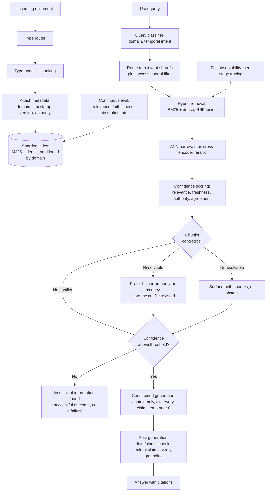

## Problem Statement

Design a retrieval-augmented generation system over a 10-million-document corpus where hallucination must be minimized as close to zero as engineering allows.

This is reportedly a real question asked in a Google L5 loop, and it's a good one — at this scale, the problem stops being "which LLM should I call" and becomes "how do I build a retrieval and verification system I can trust." The model is almost incidental. The architecture around it is the actual answer.

## Goal reframing

The first move — and arguably the single highest-signal thing to say in this interview — is to challenge the premise stated in the prompt.

**"Zero hallucination" is not an achievable engineering target.** At 10 million documents, there will be contradicting sources, stale information, ambiguous queries, and retrieval noise that no reranker or confidence score fully eliminates. Promising zero sets an expectation the system cannot honestly meet.

The honest, buildable target is: **grounded generation, with confident abstention as a first-class successful output, not a failure state.** A system that says "I don't know" when it lacks sufficient evidence is *working correctly*. A system that confidently states something wrong is the actual failure mode being designed against.

Every decision below optimizes for this reframed goal — minimize hallucination, and make abstention cheap, common, and honest, rather than chasing an unreachable zero.

## Clarifying assumptions

- **Document types:** heterogeneous — contracts, wikis, code, spreadsheets, PDFs, structured records. Not a single uniform corpus.
- **Freshness:** documents update continuously, and **can genuinely contradict each other** — superseded policies, conflicting versions, different sources disagreeing on the same fact.
- **Domain:** general-purpose across an organization (legal, engineering, HR, product) — different domains carry different risk if wrong, but the system can't always know per-query which domain's stakes are higher unless documents are tagged.
- **Scale:** 10M documents, high query volume (assume a large organization — tens of thousands of internal users, meaningful req/sec).

## Why a generic pipeline breaks at this scale

A naive RAG pipeline — chunk everything the same way, embed it, run one vector search, generate — fails for reasons specific to scale and heterogeneity, not just volume:

- **One chunking strategy doesn't fit all document types.** A legal clause split mid-sentence, a code function split mid-body, or a spreadsheet row stripped of its header context are each individually unusable, even when retrieval *found* the right document.
- **Searching the full 10M-doc index per query is wasteful and imprecise.** Most queries structurally belong to one domain; searching everything increases the odds of retrieving a plausible-sounding but wrong-domain chunk.
- **Contradictions are inevitable at this volume**, and a system that silently picks one source when two disagree is a hallucination risk hiding inside otherwise-correct retrieval.
- **A flat, one-size freshness policy is wrong.** A query about current policy needs recent documents; a query about historical policy needs the opposite. Decaying all old documents equally breaks the second case.

Each of these maps directly to a component below.

## Architecture overview

## 1. Ingestion — type-aware, not generic

A single chunking strategy is structurally wrong at this scale, because "document" means very different things across a large organization.

| Document type | Chunking strategy | Why |
|---|---|---|
| Legal / contracts | Clause-boundary-aware, never split mid-clause | A partial clause is often misleading on its own |
| Code | Function/class-boundary-aware | Splitting mid-function destroys the unit of meaning |
| Structured data (spreadsheets, tables) | Row/table-aware, header context preserved | A row without its column headers is unusable |
| Wikis / prose | Semantic paragraph chunking with overlap | Preserves topic continuity across chunk boundaries |

**Design:** a **document-type router** at ingest time — classified by extension, structure, or a cheap classifier — dispatches each document to a type-specific chunker. All chunkers converge on the same downstream schema (text, embedding, metadata), so retrieval and generation never need to know which pipeline produced a given chunk.

Every chunk is stamped with metadata at this single point: `doc_id, doc_type, domain, timestamp, version, source_authority, entity_tags`. This has to happen once, correctly, at ingestion — it is effectively unrecoverable later, and it's the metadata every downstream filtering and scoring step depends on.

**Alternative rejected:** a single generic chunker (fixed token windows) across all document types. It's the simplest possible approach, and it's exactly what breaks first — it either over-splits structured content or under-splits prose, producing chunks that are technically retrievable but semantically broken.

## 2. Domain routing — don't search all 10M documents per query

**Design:** before retrieval runs, a cheap query classifier (or rule-based routing against metadata/keywords) determines which domain shard(s) a query belongs to — legal, engineering, HR, and so on — and hybrid search only runs against that shard, not the full corpus.

**Why this is a precision fix, not just a speed fix:** running full hybrid retrieval across an undifferentiated 10M-document index doesn't just waste compute on categories that can't be relevant — it increases the odds of retrieving a chunk that happens to share vocabulary with the query but belongs to the wrong domain entirely (a marketing document surfacing for a legal question because of overlapping terms). Narrowing the search space first is itself a hallucination-reduction technique, not an optimization layered on afterward.

This same routing layer is the natural place to apply **access-control filtering** — a shard boundary and a permission boundary can be the same mechanism, checked once, at the same stage.

**Alternative rejected:** search the full corpus and rely entirely on reranking to sort out relevance afterward. Reranking is expensive per candidate and works best on an already-plausible candidate set — asking it to also do the job of domain filtering wastes its precision on a problem routing solves more cheaply upstream.

## 3. Hybrid retrieval within the routed shard

- **BM25** (exact term, clause number, ID matching) and **dense embeddings** (semantic matching) run in parallel, within the domain shard(s) selected above.
- Combine results with **Reciprocal Rank Fusion (RRF)** rather than a raw weighted score sum. RRF combines *rank positions* across the two result lists instead of blending raw scores — this sidesteps the calibration problem of merging two differently-scaled systems (bounded cosine similarity vs. an unbounded BM25 score), and it doesn't need a hand-tuned mixing weight re-derived per domain.
- **ANN search** (HNSW-style index) narrows each shard's vectors to a fast top-N candidate set; a **cross-encoder reranker** then rescores that smaller set jointly against the query text for precision — expensive per comparison, but only ever run on tens of candidates, never the full shard.

**Alternative rejected:** a single fixed fusion weight (`α · cosine + (1-α) · BM25`) tuned once globally. Different domains genuinely need different weightings (legal favors exact clause matching; general knowledge favors semantic matching) — a global constant either overfits one domain or underperforms everywhere. RRF avoids needing that tuning at all.

## 4. Confidence scoring — multi-factor and query-aware

A single retrieval score is not enough signal to decide whether to trust an answer. Combine:

- **Retrieval/rerank score** — base relevance from the stage above
- **Freshness, weighted by query intent** — not a flat decay curve. The query classifier from step 2 also detects temporal intent: a query implying "current policy" should weight recent documents heavily; a query implying "what was the policy in 2019" should invert or disable that decay entirely. Applying one decay curve to every query breaks the second case outright.
- **Source authority** — an internal audit document should outweigh a casual wiki edit on the same topic
- **Cross-chunk agreement** — do multiple independently retrieved chunks corroborate the same claim?

That last factor is where contradiction handling plugs in directly.

### 4.1 Handling contradicting documents

At 10 million documents, conflicting sources are not an edge case — they're expected (superseded policies, differing regional rules, outdated vs. updated specs). Silently picking one source and generating confidently from it is a hallucination hiding inside otherwise-correct retrieval.

**Design:** when top-ranked chunks disagree on a factual claim, branch:
- **Resolvable conflict** (e.g., a document explicitly superseded by a newer one) — prefer the higher-authority or more recent source, but the generation step is explicitly instructed to *state that a conflict existed and which source won*, rather than presenting the answer as if it were uncontested.
- **Unresolvable conflict** (genuinely ambiguous, no clear authority or recency signal) — either surface both sources with their citations and let the user judge, or abstain and flag for human review.

**Alternative rejected:** always trust the single highest-scoring chunk and ignore disagreement among the rest. This is simpler, but it converts "the corpus disagrees with itself" into "the system confidently states one side" — precisely the failure mode the whole design exists to prevent.

A **confidence gate** sits after this stage: if the combined score (or an unresolved conflict) falls below a threshold, the system abstains — "insufficient information found" — *before* the LLM is ever called. This is cheaper than generating and checking afterward, and it's the most reliable single lever against hallucination, because it removes the opportunity for the model to guess at all.

## 5. Constrained generation

The system prompt enforces hard rules, not soft suggestions: answer only using the provided context, cite every claim with an explicit source reference, state plainly that the documents don't contain sufficient information if that's true, never fill gaps using the model's own pretrained knowledge, and generate at a temperature near zero — creativity is the opposite of what this system needs.

If a contradiction was flagged upstream, the prompt explicitly instructs the model to surface it in the answer rather than silently resolving it on its own.

**Why explicit, consequence-defined instructions work better than vague ones:** modern instruction-tuned models follow specific, bounded rules ("cite every claim or say you don't know") far more reliably than open-ended guidance ("answer based on the documents"). The difference is giving the model an unambiguous compliance target versus a vague aspiration.

## 6. Citation-backed output

Every claim in the answer is traceable to an exact document, version, and chunk. This is not optional at this scale — it's what makes an answer auditable, what lets a disputed claim be traced back to its source and corrected, and it's specifically what makes the contradiction-surfacing step from earlier legible to the end user: "Source A, updated 2024, states X; Source B, from 2021, states Y" is only useful if both sources are named precisely.

## 7. Post-generation verification

Even with constrained generation, treat the model's output as unverified until checked — a generation-time instruction is a strong nudge, not a guarantee.

**Design:** after generation, extract the factual assertions in the answer (entities, numbers, dates, claims) and verify each one actually appears, in substance, in the retrieved context that was provided. If an assertion in the answer isn't grounded in any retrieved chunk, it's flagged — not silently deleted, but surfaced as an unverified claim, since suppressing it without explanation is its own kind of dishonesty about system confidence.

A faithfulness score (grounded assertions ÷ total assertions) below a threshold either triggers a stricter regeneration pass or converts the response into an explicit "cannot verify" outcome.

## 8. Fine-tuning vs. retrieval — a deliberate boundary

Worth stating explicitly, since it's a natural question at this scale: **retrieval owns knowledge, fine-tuning owns behavior.**

Fine-tuning bakes information into model weights — it has no citations, no access control, no way to delete a fact once learned, and evidence suggests it can *increase* hallucination on facts introduced after a model's pretraining cutoff, since the model has no mechanism to distinguish confidently-learned fine-tuning facts from confidently-guessed ones. None of that is compatible with an auditable, correctable, access-controlled knowledge system.

Fine-tuning still has a legitimate role here — teaching the model *how* to format citations, *how* to phrase an abstention, *how* to follow the domain's tone — but never as a substitute for grounding facts in retrieved, traceable documents.

## 9. Deployment — API vs. self-hosted, revisited for regulated domains

The API-vs-self-hosted trade-off from smaller-scale RAG designs still applies, but one factor becomes decisive at this scale and in regulated or sensitive domains (legal, healthcare-adjacent, financial): once retrieval is doing the real work, **the generation model becomes interchangeable** — any sufficiently capable model can sit at the end of a well-built retrieval pipeline. That interchangeability is precisely what makes self-hosting (on-prem, nothing leaves the building) a realistic option purely for data governance reasons, independent of the cost-crossover argument used in smaller systems. The retrieval and grounding architecture is the actual asset being protected; the model is replaceable underneath it.

## 10. Continuous evaluation

The three standard RAG metrics, tracked continuously in production rather than only offline:

- **Context relevance** — are the retrieved chunks actually relevant to the query? A low score here is a retrieval problem, not a generation problem.
- **Faithfulness** — does the generated answer stay grounded in the retrieved context? A low score here means the prompt constraints need to be stricter, or the model choice reconsidered.
- **Answer relevance** — does the response actually address what was asked? Low answer relevance despite high context relevance means the model is retrieving well but ignoring the context it was given.

At this scale, add one more metric the smaller designs didn't need: **abstention rate**, tracked as a first-class signal rather than an error count. A rising abstention rate isn't automatically bad — it might mean the confidence gate is working correctly on a batch of genuinely under-covered queries. But a *falling* abstention rate combined with a falling faithfulness score is a red flag: the system may be growing overconfident.

Evaluation should run against adversarial test queries specifically, not just typical ones — queries designed to check whether the system refuses when it should, whether it can detect and surface a planted contradiction, and whether it confuses two similarly-worded but distinct documents.

## 11. Observability

Every stage needs to be individually traceable: which shard a query was routed to, which chunks were retrieved and their component confidence scores, whether a contradiction was detected and how it was resolved, the exact prompt sent to the model, the raw output before citation parsing, and the faithfulness check result. When a bad answer surfaces in production, the question is never "did it hallucinate" — it's "which specific stage let it through," and only per-stage tracing answers that.

## Closing summary

The interview signal in this problem isn't reciting a list of RAG techniques — it's recognizing that **"near-zero hallucination" is a systems property, built from many independent, layered defenses, not a property of any single component.** No reranker, no prompt instruction, and no confidence score alone gets you there. What gets you there is:

- Routing and type-aware handling that prevent irrelevant or malformed context from ever reaching retrieval
- A confidence gate that makes abstention the default outcome when evidence is weak, not a fallback
- Explicit contradiction handling, because at 10M documents disagreement between sources is normal, not exceptional
- Constrained generation and post-generation verification as two independent checks, not one
- Continuous evaluation and full observability, because a system this layered can only be trusted if every layer is individually measurable

The honest closing line for the interview: *"I'm not eliminating hallucination — I'm building a pipeline where the system knows when it doesn't know, and every claim it does make is traceable back to a real, current, authoritative source."*