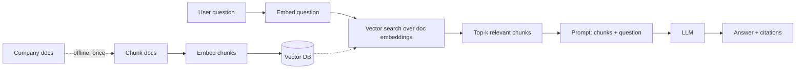
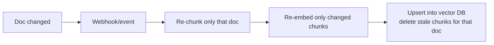
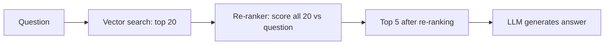
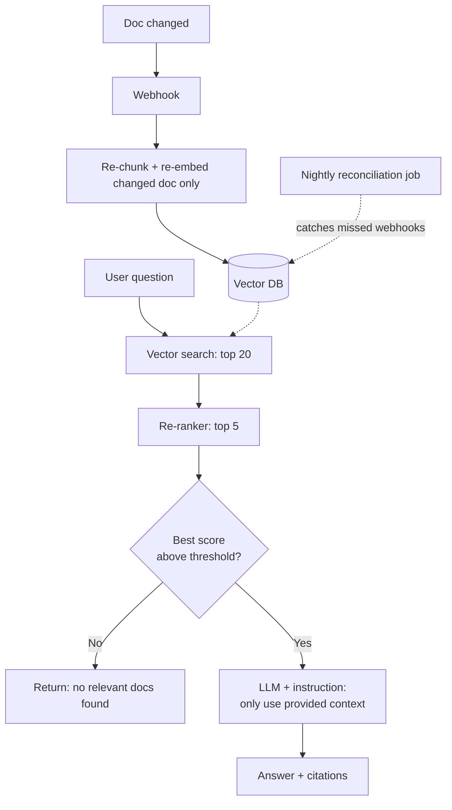
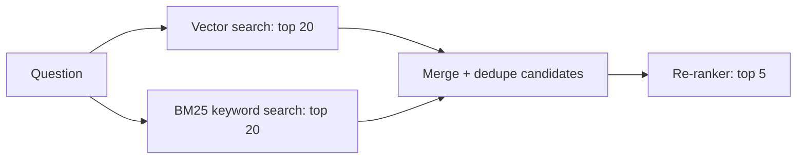
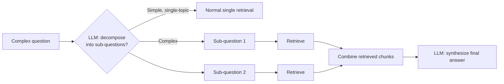
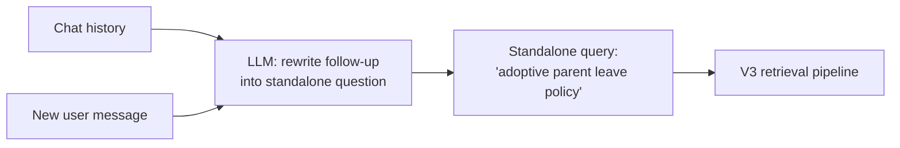
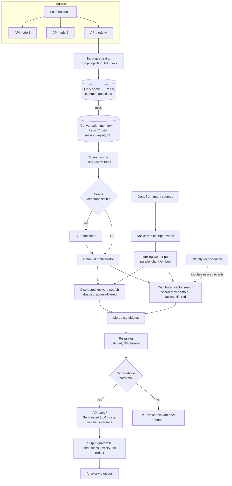
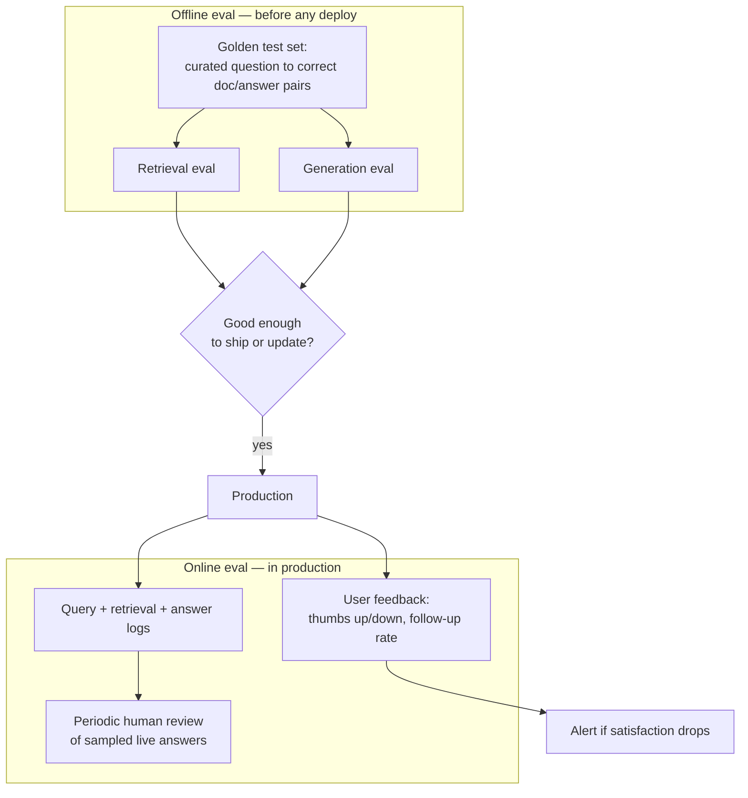

## Problem Statement

Designing a Q&A system that lets employees ask questions and get accurate answers, grounded in and cited from internal company documents (wikis, PDFs, Confluence pages).

## Clarifying the problem

The approach here is deliberately incremental: start with the dumbest possible working system, find where it breaks, and add exactly the component that fixes that specific break — with the rejected alternatives named at every step. This mirrors how the design should actually be presented in an interview.

**Baseline assumptions** (state these explicitly if not given): **1,000** internal employees, **10,000** docs (wiki pages + PDFs), docs updated a few times/day, chat-style Q&A, answers must cite sources.

## V0 — The Naive baseline

**Design:** on every question, stuff *all* company docs into the LLM's prompt and ask it to answer.

```
User question → [Prompt: ALL 10,000 docs + question] → LLM → Answer
```

**Why start here:** naming the brute-force approach first — even one you'll reject in the next sentence — proves you understand *why* the real solution exists, rather than having memorized it.

**Why it fails immediately:**
1. **Context window** — no model fits 10,000 full documents in its prompt. This fails on day one, not at scale.
2. **Cost** — every single query reprocesses the entire corpus through the LLM.
3. **Latency** — enormous prompts mean slow inference.

**Alternative considered and rejected:** relying purely on a very long context window model instead of retrieval. Rejected because cost still scales linearly with every query regardless of context size, and even million-token models don't comfortably fit a growing 10K+ doc corpus with headroom. Long-context is a real, useful technique — but as a complement to retrieval on an already-narrowed set of documents, not a replacement for retrieval itself.

**The fix these failures point to:** don't send all docs — send only the *relevant* ones. That's the definition of RAG: **R**etrieve relevant chunks, **A**ugment the prompt with them, **G**enerate the answer.

## V1 — Basic RAG



### Component-by-component reasoning

| Component | Purpose | Alternative considered | Why rejected (at this stage) |
|---|---|---|---|
| Chunking | Docs are too long to retrieve as whole units — split into ~500–1000 token chunks | Embed whole documents | A whole-document embedding blends many topics into one vector, hurting retrieval precision. Chunking gives finer-grained, more targeted matches |
| Embedding model | Converts text into vectors so "similar meaning" maps to "close vectors" | Keyword search only (BM25/Elasticsearch) | Misses semantic matches — a user asking about "vacation policy" won't match a doc titled "PTO guidelines" on keywords alone. (Revisited in V3 — keyword search isn't abandoned, just not sufficient alone) |
| Vector DB | Stores embeddings, supports fast nearest-neighbor search | Dedicated vector DB (Pinecone/Weaviate) from day one | Overkill at 10K docs (~100–200K chunks). **pgvector on existing Postgres** is simpler — one less system to operate — and only loses out at much larger scale (addressed explicitly in V5) |
| Top-k retrieval | Pass only the k most relevant chunks (e.g. k=5) into the LLM prompt | Pass all chunks above a similarity threshold | Threshold-based retrieval makes prompt size unpredictable (2 chunks one query, 200 the next). Fixed top-k keeps cost and latency predictable, at the cost of occasionally missing a relevant chunk ranked just outside k |

**Why this fixes V0's problems:** 
- Context window: only ~**5 chunks** × **800 tokens** ≈ **4K tokens** in the prompt — fits easily
- Cost: LLM only processes a small relevant slice per query
- Latency: vector search is fast (milliseconds), small prompt = fast LLM response

### V1's breaking points (each fixed in a later version)

1. Docs update multiple times/day — nothing keeps embeddings fresh
2. A question needing info from *two* different docs may not get both in one top-k pass
3. Semantically-similar-but-actually-irrelevant chunks can be retrieved and mislead the LLM
4. No handling for "the docs don't actually answer this" — risk of hallucination
5. No access control — every employee's query searches the entire corpus regardless of permissions
6. Single Postgres/pgvector node — fine now, ceiling unknown

## V2 — Freshness, hallucination guardrails, retrieval quality

### Fix 1 — Doc freshness

**Design:** event-driven **incremental indexing** — re-chunk and re-embed only the document that changed, triggered by a webhook (or poll) from the source system.



| Alternative | Rejected because |
|---|---|
| Full nightly re-embed of the whole corpus | Recomputes 9,999 unchanged docs to catch 1 change — wasteful, and changes stay stale for up to 24h even though the change event fired immediately |
| Re-fetch and embed the live doc on every query | Turns every query into a full re-index operation, destroying latency |

**Safety net added:** a nightly reconciliation job checks each doc's last_modified timestamp against the vector DB's indexed timestamp to catch any webhook that was missed `(last_modified timestamp > indexed timestamp)`, due to network blip or delivery failure. It's cheap, infrequent, and closes the gap the event-driven design alone can't guarantee.

### Fix 2 — Hallucination

**Design:** two guardrails together, not one:

1. **Prompt-level instruction** — tell the LLM explicitly to only answer from the provided context and say "I don't know" otherwise. Cheap, always included, but insufficient alone (models still hallucinate despite instructions).
2. **Retrieval confidence check** — if the top-k chunks' similarity scores all fall below a threshold, skip the LLM call entirely and return "no relevant docs found." Cheaper *and* more reliable than hoping the model self-polices.

| Alternative | Rejected because |
|---|---|
| Trust prompt instructions alone | Not reliable enough on their own, especially with ambiguous retrieval |
| A second LLM call to fact-check the first answer against the chunks | A real technique for high-stakes RAG, but doubles cost/latency per query — reserve for later if measured hallucination rate justifies it, not preemptively |

### Fix 3 — Retrieval quality (multi-doc answers, imprecise matches)

**Design:** add a **re-ranking** stage between retrieval and generation — two-stage retrieval.



Vector similarity search is fast but approximate — good at narrowing 10K docs to ~20 plausible candidates, weaker at fine-grained ranking. A re-ranker *(a cross-encoder that scores question and chunk *together*, rather than as separate vectors)* is slower but far more precise — and it only runs on 20 candidates, so the added cost is small.

| Alternative | Rejected because |
|---|---|
| Just raise k instead of re-ranking | More chunks means more cost and more chance of irrelevant context confusing the LLM ("lost in the middle" — models attend worse to information buried deep in a long context) |
| Run the re-ranker over the whole 10K-doc corpus directly, skip vector search | Cross-encoder comparisons are expensive; 10,000 of them per query destroys latency. Vector search's job is cheap coarse filtering; re-ranking's job is expensive fine filtering — that division of labor is the point |

### V2 architecture



## V3 — Hybrid search, access control, scale checkpoint

### Fix 4 — Semantic-only search misses exact matches

**Problem:** embeddings are great for meaning, weak on exact tokens — error codes, SKUs, names, acronyms.

**Design:** **hybrid search** — run *BM25 keyword search* and *vector search* in parallel, merge candidates, feed the combined pool into the existing re-ranker.



| Alternative | Rejected because |
|---|---|
| Semantic search only | Fails on exact-match queries — the gap being fixed here |
| Keyword search only | Fails on paraphrased/semantic queries — reintroduces V0/V1's original problem |
| Fine-tune the embedding model on company vocabulary instead | More effective long-term, but needs labeled data that doesn't exist yet. Hybrid search is an immediate fix with off-the-shelf components; fine-tuning becomes viable once real query logs exist (see V4) |

No new architectural stage is needed — the re-ranker already built in V2 is exactly the right place to resolve which of the (now more diverse) candidates actually matter.

### Fix 5 — Access control

**Problem:** V1/V2 assumed a flat, fully-visible corpus. Real company docs have permissions (HR-only, exec-only, team-specific).

**Design:** metadata filtering *at the retrieval query itself*:

```python
# Each chunk stores: {embedding, text, doc_id, allowed_groups: [...]}
# Query: vector/keyword search WHERE allowed_groups ∩ user's groups ≠ ∅

user = authenticate(request)
permissions = get_user_permissions(user)

docs = vector_store.similarity_search(
    query,
    k=5,
    filter={
        "allowed_groups": {
            "$in": permissions.groups
        }
    }
)

answer = llm.generate(
    question=query,
    context=docs
)

return {
    "answer": answer,
    "sources": [
        {
            "title": d.metadata["title"],
            "page": d.metadata.get("page")
        }
        for d in docs
    ]
}
```

| Alternative | Rejected because |
|---|---|
| Retrieve first, filter unauthorized chunks afterward | A security bug, not just an inefficiency — an unauthorized chunk could influence the generated answer before being filtered out. Filtering has to happen at retrieval time |
| Separate vector index per team | Doesn't scale organizationally — reorgs, cross-team docs, and new teams all force re-partitioning. Metadata filtering on one shared index is far more maintainable |

### Scale checkpoint at V3

Assuming growth to **100K** docs, **10K** employees, high query volume:
- 10K employees, say 5 questions/day each → 50,000 queries/day → ÷86,400s ≈ **0.6 req/sec** avg, peak maybe 5-10x during work hours ≈ **3-6 req/sec**
- 100K docs × ~10 chunks/doc avg ≈ **1M chunks** to index

| Component | Still fine? | Reasoning |
|---|---|---|
| API/orchestration layer | Yes | Single-digit req/sec is trivial for one server |
| pgvector on Postgres | Borderline | Comfortable into the low millions of vectors with proper indexing (HNSW); 1M+ with continued growth is where a dedicated vector DB starts to win |
| LLM calls | Yes, architecturally | Cost, not architecture, becomes the relevant conversation at this volume |
| Re-ranker | Yes | Runs on a fixed ~20–40 candidates per query regardless of corpus size — its cost doesn't grow with corpus growth |

**Key insight:** corpus size mostly affects the *retrieval* stage, not generation — because retrieval always narrows down to a fixed small k before the LLM ever sees anything. That's structurally why RAG scales well: the expensive part (LLM inference) has roughly constant cost per query regardless of corpus size.

## V4 — Multi-hop retrieval, memory, fine-tuning, LLM hosting choice

### Multi-hop / query decomposition

**Problem:** some questions can't be answered by one retrieval pass — e.g. "Compare our parental leave policy to the competitor benchmark doc" blends two topics into one query embedding, retrieving neither well.



A cheap LLM call *(a lightweight agentic step)* first classifies whether decomposition is needed; each sub-question reuses the same V3 hybrid+rerank pipeline; a final LLM call synthesizes across all retrieved chunks.

| Alternative | Rejected because |
|---|---|
| Always retrieve with a larger k to "cover" complex questions | Doesn't address the root cause — a multi-topic question's embedding poorly represents either topic. More k retrieves more noise, not more relevant content |
| Let the LLM always ask clarifying follow-ups instead of decomposing | Valid for genuine ambiguity, but adds an unnecessary round-trip for questions that are clear but simply multi-topic |

**When to add this:** only once evaluation data shows a meaningful fraction of failures are multi-hop — it adds latency (extra LLM call, multiple retrievals), so it isn't built speculatively.

### Conversation memory

**Problem:** a follow-up like "What about for adoptive parents?" has no retrievable signal on its own.



A small, cheap LLM call rewrites the follow-up into a standalone query using the last few turns of history; the rewritten query flows through the *same* retrieval pipeline unchanged — memory fixes the input to retrieval, not the retrieval architecture itself.

| Alternative | Rejected because |
|---|---|
| Stuff full chat history into the generation prompt directly | Doesn't fix retrieval — the retrieval step still searches on the bare follow-up and finds nothing relevant. History has to inform what you search for, not just what you generate from |
| Embed the whole conversation as one query vector | Blends multiple topics across turns into one vector — the same precision loss as the multi-hop problem |

#### Database choice for conversation memory

| Option | Verdict | Reasoning |
|---|---|---|
| **Redis** | Chosen | History is short-lived (session TTL, e.g. 30–60 min idle timeout), keyed by session ID, and read on every single query before rewriting even happens — needs to be fast. Redis is purpose-built for this: in-memory key-value with native TTL |
| Postgres table | Rejected | Works, but adds unnecessary read latency to a step that runs on every query, and requires manual cleanup jobs that Redis's TTL gives for free |
| DynamoDB / managed NoSQL | Rejected at this scale | A legitimate option once operating across regions at very large scale (see V5), but unneeded operational cost/complexity at moderate scale |
| Store conversation in the vector DB | Rejected | Already ruled out above — imprecise for exact recent-turn lookup, which is what memory actually needs |

At Microsoft-scale (V5), a **sharded Redis Cluster** remains the right choice — session data partitions naturally by *session ID*, and Redis Cluster scales horizontally for exactly this access pattern. A move to DynamoDB is only justified if cross-region session portability becomes an actual requirement, not preemptively.

### Fine-tuning embeddings on company vocabulary

**When this becomes worth it:** only once real usage data exists — query logs, thumbs-up/down feedback — never a day-one decision.

**Design:** fine-tune the embedding model on `(query, correct chunk)` pairs mined from real usage (e.g., queries where a user marked a specific cited chunk as helpful become positive training pairs), using a contrastive loss to sharpen the embedding space around company-specific jargon — internal project codenames, acronyms, org-specific terms a generic embedding model was never trained on.

| Alternative | Rejected because |
|---|---|
| Manual synonym-expansion rules (e.g., always append "aka PTO" near "vacation") | Doesn't generalize, grows brittle as vocabulary expands |
| Train a fully custom embedding model from scratch | Unjustified cost — fine-tuning a strong open base model captures company vocabulary with far less data and compute |

**Why not earlier:** no query logs exist before the system is live. Off-the-shelf embeddings are good enough to bootstrap and start collecting the data this step depends on — it's a data-flywheel improvement, not a foundational piece.

### LLM hosting — API vs self-hosted inference

| Factor | API (OpenAI/Anthropic/etc.) | Self-hosted (open model, own GPUs) |
|---|---|---|
| Time to build | Fast, no infra | Slow — GPU provisioning, serving stack (vLLM/TGI), ops expertise required |
| Cost at low/medium volume | Cheaper — pay per token, no idle cost | More expensive — GPUs cost the same whether idle or busy |
| Cost at very high, steady volume | Per-token cost adds up | Can become cheaper — fixed GPU cost amortized over huge query volume |
| Data privacy | Data leaves your infra (mitigated by enterprise/zero-retention terms) | Data never leaves your infra — matters directly for internal company docs |
| Latency control | Provider-dependent | Full control over batching, hardware, colocation |

**Decision at V1–V3 scale:** API-based LLM — fastest to build, and query volume (single-digit req/sec) doesn't come close to justifying dedicated GPU infrastructure.

**Revisit self-hosting when:** data governance mandates docs never leave the network, **or** measured API cost genuinely exceeds projected GPU infra cost — both concrete, measurable triggers, not speculative ones.

## V5 — Scaling to Microsoft-scale, guardrails, and the final architecture

### Capacity estimate at massive scale

Assume ~**230,000** employees, ~**5,000,000** documents, ~**100** questions/employee/day (a broad internal knowledge tool, not a niche one).

- **Query volume:** 230,000 × 10 = 23M queries/day → ÷86,400s ≈ **277 req/sec average**; concentrated peak hours across time zones (~12 effective peak hours) → ≈ 23M ÷ 43,200s ≈ **533 req/sec**, with bursts 3–5x that → **1500–2500 req/sec**
- **Corpus size:** 5M docs × ~10 chunks/doc ≈ **50 million chunks**

### Comparing against known thresholds

| Metric | Value | Threshold | Verdict |
|---|---|---|---|
| Req/sec | 1500–2500 peak | Single server: ~1K–5K/sec | Still fine for a **stateless API layer** — needs several instances behind a load balancer, not a redesign |
| Vector count | 50M chunks | pgvector comfortable zone: low millions | Must move to a **distributed vector DB** (sharded Milvus/Vespa/a managed distributed vector service) — single-node pgvector can't hold or serve this efficiently |
| LLM inference cost | 23M queries/day | N/A — cost, not architecture | Crossover point reached: **self-hosted, batched inference becomes economically justified** per the V4 API-vs-self-host analysis |

### Guardrails — where they belong

Two checkpoints, not one, sitting explicitly in the pipeline:

- **Input guardrails** (before retrieval): prompt-injection detection, blocking attempts to extract restricted info through indirect phrasing, PII detection on the incoming query
- **Output guardrails** (after generation, before the answer reaches the user): toxicity/safety check, a faithfulness check that the answer stays grounded in the retrieved chunks (feeding into the evaluation framework below), and redaction of any PII the model might echo from context

### New components at this scale, and why each is justified now (not earlier)

| Component | Why it's needed now, not in V1–V4 |
|---|---|
| Load balancer + multiple API nodes | 1500–2500 req/sec with orchestration overhead exceeds comfortable single-node headroom |
| Query cache (Redis) | At this volume, many employees ask overlapping questions ("what's our PTO policy") — caching common Q&A pairs meaningfully cuts LLM cost and latency. Not worth it at 0.6 req/sec (V3), clearly worth it here |
| Sharded/distributed vector DB | 50M vectors exceeds pgvector's comfortable zone; sharding by domain (HR, engineering, sales) also aligns naturally with the access-control groups from V3 |
| Kafka event stream for doc changes | At 5M docs across many source systems, per-doc webhooks alone can't absorb the volume/concurrency of change events — a durable event log with a worker pool decouples "doc changed" from "doc reindexed," and survives worker crashes and backpressure |
| Self-hosted, batched LLM serving (e.g. vLLM) | Cost crossover point reached; batched serving also improves GPU utilization in a way that's wasted at low query volume |

**Explicitly rejected even at this scale:** 
- Sharding the API layer itself by team/region into separate deployments. 
- Stateless API nodes behind one load balancer scale horizontally; without that, organizational sharding only pays off with genuinely independent deployment/ownership needs, which a shared Q&A tool doesn't have.

## Final complete architecture



## Full Evaluation framework

The most heavily weighted part of a RAG/LLM system design round — "does it work" needs a measurable definition, not a vibe check.



#### Retrieval metrics — is the right document even being found?

- **Recall@k** — is the correct chunk present in the top-k retrieved results? The single most important metric, since generation can't succeed if retrieval already failed.
- **MRR (Mean Reciprocal Rank)** — how high up the correct chunk is ranked, not merely whether it's present at all.
- Both are measured against a **golden set**: a curated list of realistic questions with known correct source documents, ideally mined from real early-user queries rather than synthesized guesses.

#### Generation metrics — given good retrieval, is the answer actually good?

- **Faithfulness / groundedness** — does the answer state only things present in the retrieved chunks? Typically measured with an **LLM-as-judge** comparing the answer against the source chunks, flagging unsupported claims.
- **Answer relevance** — does the answer actually address what was asked (a distinct failure mode from faithfulness — an answer can be fully grounded yet not actually answer the question).
- **Citation accuracy** — do the cited sources genuinely support the claims placed next to them.

#### Online/production signals — does it hold up for real users over time?

- Thumbs up/down per answer — cheap, direct signal.
- Follow-up-question rate as an implicit failure signal — repeated rephrasing usually means the first answer didn't help.
- Periodic human spot-review of a sample of live queries, catching drift and failure modes automated metrics miss.
- **"No relevant docs found" rate**, tracked explicitly — a rising rate signals either corpus gaps or retrieval degradation.

#### Why LLM-as-judge instead of relying only on human review or simple text-overlap scores?

Human review doesn't scale to every production answer, and surface metrics like **ROUGE/BLEU** measure textual overlap, not factual correctness — an answer can score well on overlap while still being ungrounded. An LLM judge comparing the answer against the retrieved source chunks is the current practical standard, cross-checked periodically against real human review to catch cases where the judge itself is wrong.

#### Why this is a closed loop, not a one-time gate?

The golden-set evaluation gates any change — a new embedding model, a new prompt, a new re-ranker — before it ships. Online signals catch failure modes the golden set didn't anticipate. Both feed back into the fine-tuning data pipeline (V4) and into golden-set expansion. The evaluation framework runs continuously alongside the RAG pipeline itself; it isn't a step you complete once.

## Closing summary

The system evolved through five deliberate stages, each one fixing a specific, named failure of the version before it:

- **V0 → V1:** naive full-context stuffing → retrieval, because context windows and cost don't allow brute force
- **V1 → V2:** basic retrieval → freshness pipeline, hallucination guardrails, and two-stage retrieval, because a static index and blind trust in the LLM both fail in practice
- **V2 → V3:** semantic-only, ungated search → hybrid search and access-control filtering, because pure embeddings miss exact matches and a shared corpus needs permission boundaries
- **V3 → V4:** single-shot retrieval → multi-hop decomposition, conversation memory, and a data-driven fine-tuning path, because real usage surfaces multi-topic questions, follow-ups, and company-specific vocabulary that the earlier design didn't anticipate
- **V4 → V5:** moderate scale → distributed retrieval, self-hosted batched inference, caching, and an event-streamed indexing pipeline, because the numbers at Microsoft-scale cross concrete, measurable thresholds — not because bigger is inherently better

At every stage, the guiding principle was the same one that applies to any system design problem: match the architecture to the *actual*, *current* constraints — team size, deadline, query volume, corpus size — and name the next upgrade explicitly rather than building it before the evidence calls for it.